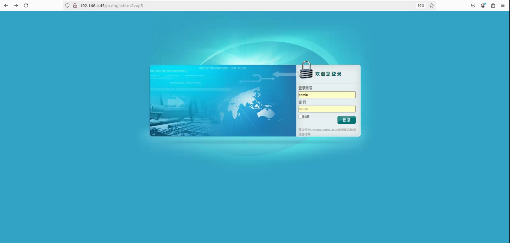

# 自动驾驶硬件检测
## LiDAR检测
- Ctrl+Alt+t 启动终端：用户名：pixbus，用户名密码：pixmoving
1. 左前雷达IP：192.168.1.120
2. 右前雷达IP：192.168.1.122
3. 左后雷达IP：192.168.1.123
4. 右后雷达IP：192.168.1.121

## GNSS检测
### 登录组合导航界面
- 打开浏览器，在地址栏输入 192.168.4.45，弹出登陆界面，账号：admin，密码：password

- 进入到IO 配置界面，选择“RTK 客户端”，点击“连接”，连接协议可以选择 NTRIP/TCP/APIS协议，输入账号密码等相关信息后，最后点击“确定”。

**注意1**：不要用火狐浏览器打开，否则参数不能修改成功。

**注意2**：获取源列表时，一定要注意右下角弹出源列表获取成功，否则RTK登录失败，检查是否给设备供网。

**注意3**：RTK支持国外差分，但必须保证基站播发的是标准的RTCM语句，国内外统一支持卫星：GPS，北斗，伽利略，格洛纳斯，准天顶。

### GNSS校准
- 实车操作：INS模式先是卫导，然后初始化，最后组合惯导。车辆一定要开到户外，且周围较为空旷，无高大遮挡建筑物。车辆出厂前进行过GNSS校准，保证RTK及网路正常，车辆以15km速度行驶，大概需要二十分钟左右方即可校准成功，如果INS模式一直没变化，请检查RTK账号是否登录成功及网络是否通讯正常。
1. 惯导状态：INS模式为卫导；
    
2. 惯导状态：INS模式为初始化；
    
3. 惯导准态：INS模式为组合惯导状态，组合信息为GNSS | MIU
    

## 相机检测
- 远程监控相机\*7：左前雷达下方\*1，右前雷达下方\*1，左后雷达下方\*1，右后雷达下方\*1，正前方\*1，正后方\*1，车内\*1；

- 视觉感知相机\*2：正前方\*1，车辆顶部相机\*1。

## 超声波雷达检测
- 超声波雷达探头\*12：正前方\*4,正后方\*4 ，左侧\*2，右侧\*2；

